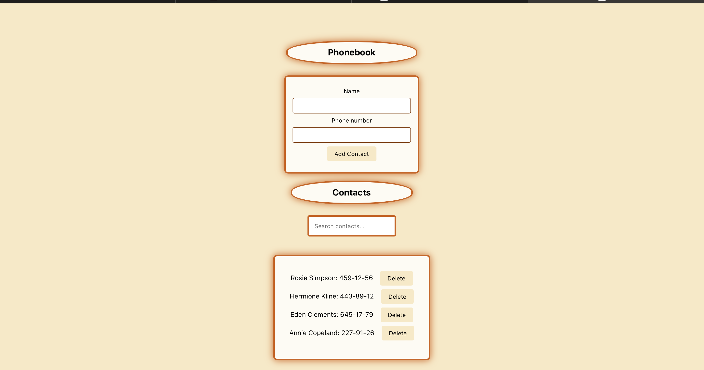

Nazwa Projektu : "goit-react-hw-02-phonebook"

Screenshot : 

Opis :

Projekt ma za zadanie ułatwić urzytkownikowi utworzenie elektronicznej ksiaki telefonicznej

Instalacja :

1. pobrać to repozytorium z mojego githab-a
2. odapalić VS code 
3. Terminal : npm install -> npm start 
4. I w tym momencie mozna juz pracować nad własną ksiązką telefoniczną ^^